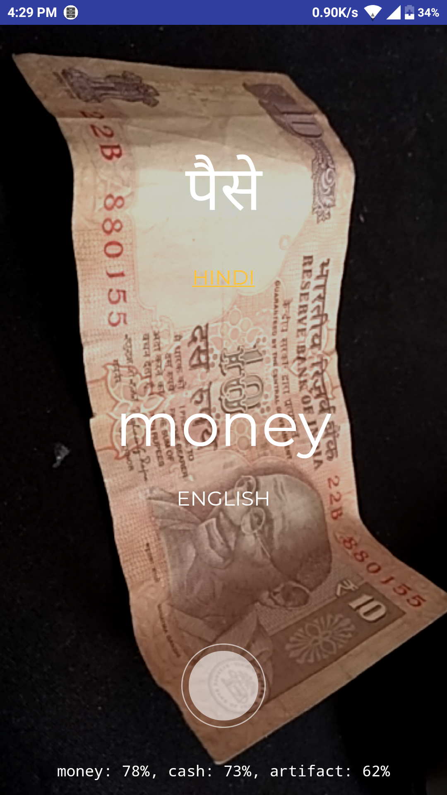
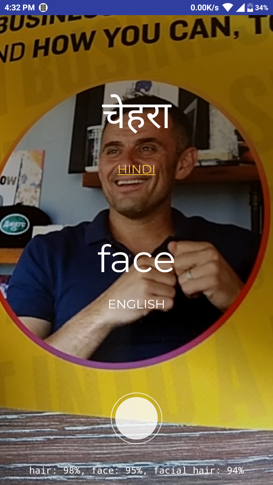

# ThingsTranslator

<b>Inspired By</b>: Google AI Projects
 

ThingsTranslator is an Android application by which uses two main concept:
1. Image Processing
2. Object Character Recognition

By using this two main concept this application can able to detect things and translate it into your own local language, and also you can detect the text by hower over camera on text in real time.

# Examples:
<b>Object Detection:</b> 

     

<b>Object Character Recognition:</b> 

     
 
 
# AIM:

Our aim behind building this is: There are 27 states and 7 Union Territories in INDIA -- With 22 scheduled languages are there, and most spoken languages are Hindi, Bengali, Telugu, Marathi so if we want wander around other region in India outside our place there may be consequences that we may not know that language of that particular region, we find language barrier due to not understanding the language they speak plus there is if we want to read newspaper in other region so there would be also consequences that newspaper language is also in language that we don’t know there is also a language barrier and also last but not the least if want to shop from other region the problem is same. 

we still are looking for open source api to made a fully functional application which useful for all indian peoples, so Feel free to contribute :)

# Working:

Watch youtube video: https://www.youtube.com/watch?v=xYSLxFrCJt0

# Research Paper:

official paper link: http://ijsart.com/Home/IssueDetail/20872

# Future Implimentation:

1. We are really looking to develop this whole project to "Sanskrit" language also because sanskrit is the source of our all indian languages, and there is nothing available for sanskrit language. 
2. This is not just it, we are also planning to detect numbers and if possible we can try to find the owner of the number plate. 
3. we can detect different type of foods. 
4. if we able to detect text of all indian languages than we can translate it into other languages too that make our work far more easier, we no need type whole hindi paper into english or tamil, we can able read sign board in every state of india, even in different different counrties too. 

Feel free to add your future implimentation ideas here :)
Feel free to fork an contribute. :)

For More details you can read our Project Paper and download it from <a href="https://github.com/bhattsameer/ThingsTranslator/blob/master/8th%20Semester%20Final%20Year%20Report%20NEW%20.pdf">here</a>

# Team:

<a href="https://github.com/bhattsameer">Debugger</a> 
<a href="https://github.com/Anujraval24">Anuj Raval</a>
